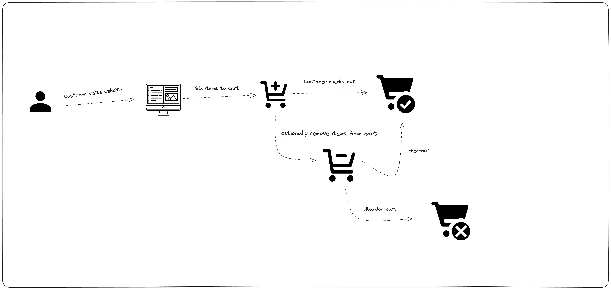

# Alt school Exams

An e-commerce startup has been kind enough to provide us with event level data around orders and customers on their platform, you've been tasked with analyzing the events data to help them answer a few questions. Kindly read through and thoroughly follow the instructions provided in this document and the readme file in the `questions` Folder.

The questions folder has an `answers.sql` file where you're expected to provide the answer to questions in part 2 of the assessment.

Note that you are to first use the information in the table schema diagram to create additional tables to the products table to load your data into Postgres.

you have been provided with a Docker compose file (WHICH YOU SHOULD NOT MODIFY!!), simply update the `infra_setup/init.sql` and you should be ready to explore the data.

The data in this assessment primarily captures event grain data around activitites carried out by customers visiting an e-commerce website. The flow is as follows:

1. customer visits the website
2. customers adds items to their carts
3. customers can also optionally remove items from their carts
4. customers can choose to checkout or abandon their carts





## A possible twist?
A fair bit of warning is to consider the events table as the most reliable single source of truth. Depending on how you look at data in the event's table you should be able to link it to orders and line items. a known technical error that wasn't fixed by engineering before delivering this dataset to you is the checkout timestamp in the orders table. 

You should rely primarily on the events data to work out actual checkouts vs. what was abandoned.


DO NOT CREATE EXPLICIT RELATIONSHIP CONSTRAINTS BETWEEN TABLES WHEN YOU CREATE THEM!! 

for example, if you have two table customers and orders where orders have a customer_id simply create the table tables without trying to enforce the foreign key relationship in you DDL statement!

## How to spin up the server

simply run `docker-compose up` in the project root folder and it should start the postgres service and then you can connect to the database via DBEAVER using this credential:

```bash
POSTGRES_USER: alt_school_user
POSTGRES_PASSWORD: secretPassw0rd
POSTGRES_DB: alt_school_db
POSTGRES_PORT: 5434
POSTGRES_HOST: localhost
```

## Managing state file

when you start docker compose a folder `pg_data` will be created in you project root folder, if you ever want to clear state information, simply kill your docker-compose service and delete the file, this will allow docker re-create postgres from scratch again and reload your data in the `./data` folder.


## How to submit:

1. Fork this github repo
2. pull your forked version of the repo locally into your laptop using git clone
3. create a branch named submission
4. write SQL statements in `questions/answers.sql` to answer the questions in part two of this assessment
5. open a pull request against **your own main branch** 
6. in your pull request provide a detailed description of what you have done
7. submit a URL to your pull request in the assessment form 